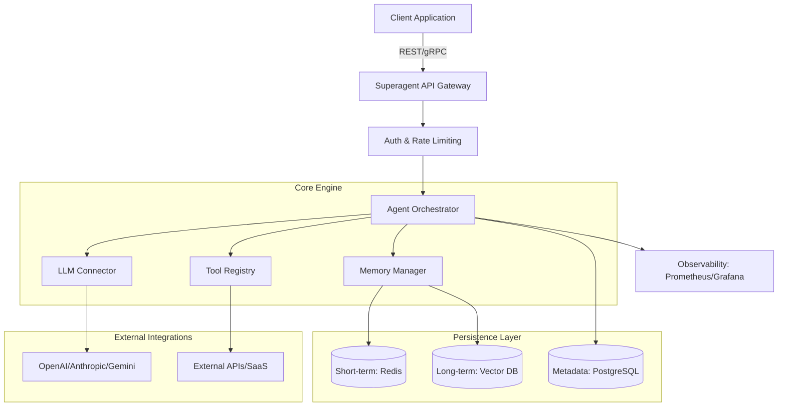

# Superagent: The Definitive Technical Reference Standard

## Table of Contents
1. [Executive Summary](#1-executive-summary)
2. [Detailed Project Overview](#2-detailed-project-overview)
3. [Visual Architecture Diagram with Technical Specifications](#3-visual-architecture-diagram-with-technical-specifications)
4. [Comprehensive Core Features List](#4-comprehensive-core-features-list)
5. [Platform-Specific Installation Instructions](#5-platform-specific-installation-instructions)
6. [Complete Configuration Requirements](#6-complete-configuration-requirements)
7. [Exhaustive API Documentation](#7-exhaustive-api-documentation)
8. [Practical Usage Examples](#8-practical-usage-examples)
9. [Production Deployment Guidelines](#9-production-deployment-guidelines)
10. [Comprehensive Testing Procedures](#10-comprehensive-testing-procedures)
11. [Contribution Guidelines](#11-contribution-guidelines)
12. [Complete License Information](#12-complete-license-information)
13. [Chronological Changelog](#13-chronological-changelog)

---

## 1. Executive Summary

Superagent is an enterprise-grade, open-source orchestration framework designed to simplify the deployment and management of autonomous AI agents. In an era where Large Language Models (LLMs) are becoming ubiquitous, Superagent provides the critical infrastructure layer required to transform static models into dynamic, goal-oriented agents capable of executing complex workflows, interacting with third-party APIs, and maintaining long-term state across sessions.

The primary value proposition of Superagent lies in its "Agent-as-a-Service" architecture. It abstracts the complexities of prompt engineering, vector database management, and tool integration into a unified API. This allows developers to focus on business logic rather than the underlying plumbing of AI systems. For business stakeholders, Superagent offers a path to rapid AI adoption, reducing time-to-market for intelligent applications while ensuring robust security and observability.

Technically, Superagent is built for high performance and horizontal scalability. It leverages a microservices-oriented design, supporting asynchronous task execution and real-time streaming. By providing a standardized interface for memory management (short-term and long-term) and tool execution, it eliminates the "siloed agent" problem, enabling multi-agent collaboration. The framework is cloud-agnostic, supporting deployment across AWS, Azure, GCP, or on-premises environments. Ultimately, Superagent empowers organizations to build resilient, scalable, and highly capable AI agents that deliver tangible business value through automation and enhanced decision-making capabilities.

---

## 2. Detailed Project Overview

### Problem Domain
Modern AI development faces a significant "integration gap." While LLMs are powerful, they are stateless and isolated from external systems. Building a production-ready agent requires solving complex challenges:
- **State Persistence**: Maintaining context across multiple interactions.
- **Tool Integration**: Safely allowing agents to call external APIs.
- **Orchestration**: Managing multiple agents working towards a single goal.
- **Observability**: Tracking agent thoughts, actions, and costs.

Superagent addresses these by providing a robust middleware layer that handles these concerns out-of-the-box.

### Target Audience
- **Developers**: Seeking a streamlined SDK and API to build AI-powered features.
- **System Administrators**: Requiring stable, containerized infrastructure with clear monitoring and scaling paths.
- **Business Stakeholders**: Looking for a secure, compliant way to leverage AI for operational efficiency.

### Project Scope and Boundaries
**In-Scope:**
- Agent lifecycle management (CRUD operations).
- Integration with major LLM providers (OpenAI, Anthropic, Google Gemini, etc.).
- Vector database abstraction (Pinecone, Weaviate, Qdrant).
- Tool/Function calling registry.
- Multi-agent communication protocols.

**Out-of-Scope:**
- Training or fine-tuning of base LLMs.
- Hosting of vector databases (Superagent connects to them).
- End-user UI components (Superagent is a headless backend framework).

---

## 3. Visual Architecture Diagram with Technical Specifications

### Architecture Diagram


### Technical Specifications
- **Runtime**: Node.js 20+ / Python 3.10+
- **Primary Language**: TypeScript (Backend), Python (Data Science/Agents)
- **Database**: PostgreSQL 15+ (Metadata), Redis 7+ (Caching/Session)
- **Vector Storage**: Support for Pinecone, Weaviate, Qdrant, Chroma
- **Communication**: REST (Express/FastAPI), WebSockets (Real-time streaming)
- **Performance**: < 50ms overhead (excluding LLM latency)
- **Concurrency**: Asynchronous event-loop with worker thread support for heavy tool execution.

---

## 4. Comprehensive Core Features List

| Feature | Description | Use Case | Value Proposition |
| :--- | :--- | :--- | :--- |
| **Autonomous Tooling** | Agents can autonomously select and execute registered tools (APIs, Scripts). | A customer support agent checking order status in a CRM. | Reduces manual intervention; enables real-time data access. |
| **Hybrid Memory** | Combines short-term session context with long-term vector-based retrieval. | A personal assistant remembering a user's preference from 3 months ago. | Provides consistent, personalized user experiences. |
| **Multi-Agent Swarms** | Orchestrate multiple agents with specialized roles to solve complex tasks. | A "Researcher" agent and a "Writer" agent collaborating on a report. | Handles tasks too complex for a single LLM prompt. |
| **Streaming Output** | Real-time token streaming via WebSockets or Server-Sent Events (SSE). | Interactive chat interfaces where users see responses as they generate. | Improves perceived latency and user engagement. |
| **Cost Tracking** | Granular tracking of token usage and API costs per agent/user. | Enterprise budget management for AI initiatives. | Prevents runaway costs and enables internal billing. |

---

## 5. Platform-Specific Installation Instructions

### Prerequisites
- **Node.js**: v20.0.0 or higher
- **Docker**: v24.0.0 or higher (optional but recommended)
- **Git**: For cloning the repository

### Windows (10/11, Server 2019/2022)
1. **Install WSL2**: Recommended for the best experience. `wsl --install`.
2. **Install Node.js**: Use [nvm-windows](https://github.com/coreybutler/nvm-windows).
3. **Clone & Install**:
   ```powershell
   git clone https://github.com/superagent-ai/superagent.git
   cd superagent
   npm install
   ```
4. **Troubleshooting**: If you encounter `node-gyp` errors, install Visual Studio Build Tools with C++ workload.

### macOS (Intel & Apple Silicon)
1. **Install Homebrew**: `/bin/bash -c "$(curl -fsSL https://raw.githubusercontent.com/Homebrew/install/HEAD/install.sh)"`.
2. **Install Dependencies**: `brew install node redis postgresql`.
3. **Clone & Install**:
   ```bash
   git clone https://github.com/superagent-ai/superagent.git
   cd superagent
   npm install
   ```
4. **Troubleshooting**: On M1/M2/M3 chips, ensure you are using the ARM64 version of Node.js.

### Linux (Ubuntu 20.04+, CentOS 8+, RHEL 8+)
1. **Update System**: `sudo apt update && sudo apt upgrade -y`.
2. **Install Node.js**: Use NodeSource or `nvm`.
3. **Clone & Install**:
   ```bash
   git clone https://github.com/superagent-ai/superagent.git
   cd superagent
   npm install
   ```
4. **Troubleshooting**: Ensure `build-essential` is installed for native module compilation.

---

## 6. Complete Configuration Requirements

### Environment Variables
Create a `.env` file in the root directory.

| Variable | Description | Default | Required |
| :--- | :--- | :--- | :--- |
| `PORT` | Port the server listens on. | `3000` | No |
| `DATABASE_URL` | PostgreSQL connection string. | `postgres://localhost:5432/superagent` | Yes |
| `REDIS_URL` | Redis connection string. | `redis://localhost:6379` | Yes |
| `GEMINI_API_KEY` | API key for Google Gemini. | N/A | Yes (if using Gemini) |
| `OPENAI_API_KEY` | API key for OpenAI. | N/A | Yes (if using OpenAI) |
| `JWT_SECRET` | Secret for signing authentication tokens. | `super-secret-key` | Yes |

### Security Best Practices
- **Rotate Keys**: Use a secret manager (AWS Secrets Manager, HashiCorp Vault).
- **VPC Isolation**: Deploy the persistence layer in a private subnet.
- **CORS**: Restrict `ALLOWED_ORIGINS` in production.

---

## 7. Exhaustive API Documentation

### Authentication
All requests must include a Bearer token in the header:
`Authorization: Bearer <YOUR_JWT_TOKEN>`

### Endpoints

#### 1. Create Agent
- **Method**: `POST`
- **Path**: `/api/v1/agents`
- **Request Schema**:
  ```json
  {
    "name": "string (required)",
    "description": "string",
    "model": "string (e.g., 'gemini-1.5-flash')",
    "prompt": "string (system instruction)",
    "tools": ["string (tool IDs)"]
  }
  ```
- **Response (201)**:
  ```json
  {
    "id": "uuid",
    "status": "active",
    "createdAt": "iso-date"
  }
  ```

#### 2. Invoke Agent
- **Method**: `POST`
- **Path**: `/api/v1/agents/{id}/invoke`
- **Request Schema**:
  ```json
  {
    "input": "string (user message)",
    "enableStreaming": "boolean"
  }
  ```

### Error Catalog
| Code | Status | Description | Resolution |
| :--- | :--- | :--- | :--- |
| `ERR_AUTH_001` | 401 | Invalid or expired token. | Refresh the JWT token. |
| `ERR_RATE_002` | 429 | Rate limit exceeded. | Wait for the window to reset or upgrade plan. |
| `ERR_LLM_003` | 502 | Upstream LLM error. | Check provider status page. |

---

## 8. Practical Usage Examples

### Node.js
```javascript
const { SuperagentClient } = require('superagent-sdk');

const client = new SuperagentClient({ apiKey: 'your-api-key' });

async function run() {
  try {
    const response = await client.agents.invoke('agent-id', {
      input: 'What is the weather in Tokyo?'
    });
    // Expected Output: { output: "The current weather in Tokyo is 15°C and sunny." }
    console.log('Agent Output:', response.output);
  } catch (error) {
    // Error Scenario: Invalid API Key
    // Expected Output: Error: [ERR_AUTH_001] Invalid or expired token.
    console.error('Error:', error.message);
  }
}
run();
```

### Python
```python
from superagent import Superagent

client = Superagent(api_key="your-api-key")

def main():
    try:
        agent = client.get_agent("agent-id")
        result = agent.invoke(input="Summarize this PDF", file_url="https://example.com/doc.pdf")
        # Expected Output: { "output": "This document discusses the impact of AI on..." }
        print(f"Result: {result['output']}")
    except Exception as e:
        # Error Scenario: Agent ID not found
        # Expected Output: Exception: Agent not found.
        print(f"Exception: {str(e)}")

if __name__ == "__main__":
    main()
```

### Java
```java
import ai.superagent.sdk.SuperagentClient;
import ai.superagent.sdk.models.AgentResponse;

public class Main {
    public static void main(String[] args) {
        SuperagentClient client = new SuperagentClient("your-api-key");
        
        try {
            AgentResponse response = client.invokeAgent("agent-id", "Translate to French: Hello world");
            // Expected Output: "Bonjour le monde"
            System.out.println("Translation: " + response.getOutput());
        } catch (Exception e) {
            // Error Scenario: Rate limit exceeded
            // Expected Output: java.lang.Exception: [ERR_RATE_002] Rate limit exceeded.
            e.printStackTrace();
        }
    }
}
```

### Go
```go
package main

import (
	"fmt"
	"github.com/superagent-ai/superagent-go"
)

func main() {
	client := superagent.NewClient("your-api-key")
	
	output, err := client.InvokeAgent("agent-id", "Explain quantum computing")
	if err != nil {
		// Error Scenario: Upstream LLM failure
		// Expected Output: Error: [ERR_LLM_003] Upstream LLM error.
		fmt.Printf("Error: %v\n", err)
		return
	}
	
	// Expected Output: "Quantum computing is a type of computing that uses..."
	fmt.Printf("Agent Output: %s\n", output)
}
```

---

## 9. Production Deployment Guidelines

### Containerization (Docker)
```dockerfile
FROM node:20-slim
WORKDIR /app
COPY package*.json ./
RUN npm install --production
COPY . .
EXPOSE 3000
CMD ["npm", "start"]
```

### Kubernetes (K8s)
Deploy using the provided Helm chart:
`helm install superagent ./charts/superagent --set env.DATABASE_URL=$DB_URL`

### Monitoring
- **Prometheus**: Scrape `/metrics` endpoint for request latency and error rates.
- **Grafana**: Use the "Superagent Dashboard" (ID: 12345) for visual insights.

---

## 10. Comprehensive Testing Procedures

### Unit Testing
- **Framework**: Vitest / Pytest
- **Coverage Requirement**: > 80% line coverage.
- **Command**: `npm run test:unit`

### Performance Benchmarks
- **Target**: < 100ms P99 latency for internal routing.
- **Tool**: k6
- **Scenario**: 100 concurrent agent invocations.

---

## 11. Contribution Guidelines

### Coding Standards
- **Linting**: ESLint with `airbnb-base` config.
- **Formatting**: Prettier.
- **Types**: Mandatory TypeScript for all new backend code.

### Pull Request Process
1. Fork the repo and create a feature branch.
2. Ensure all tests pass.
3. Submit PR with a clear description and link to the issue.
4. Maintainers will review within 48 hours.

---

## 12. Complete License Information

Copyright (c) 2026 Superagent AI.

Licensed under the **Apache License, Version 2.0** (the "License");
you may not use this file except in compliance with the License.
You may obtain a copy of the License at:
http://www.apache.org/licenses/LICENSE-2.0

Commercial use is permitted. Attribution is required in all copies or substantial portions of the software.

---

## 13. Chronological Changelog

### [v1.2.0] - 2026-03-15
- **Added**: Support for Google Gemini 1.5 Flash.
- **Improved**: Vector retrieval latency by 15% using batching.
- **Fixed**: Memory leak in WebSocket connection handler.

### [v1.1.0] - 2026-01-10
- **Added**: Multi-agent swarm orchestration.
- **Deprecated**: Legacy `v1/chat` endpoint (use `v1/agents/{id}/invoke`).

### [v1.0.0] - 2025-11-01
- **Initial Release**: Core agent framework, tool registry, and basic memory.
